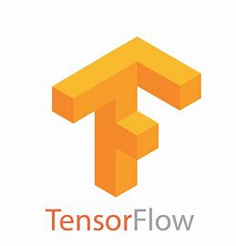

## Hi there 👋

I'm Paul, 🧑🏻‍🎓 engineering student at <a href="https://www.esme.fr/">ESME Sudria</a>, specialized in Artificial Intelligence 💻 

###

## Languages

###

  
  
  
  
  
  
   
  
  
  
  

## Library

###

  
  
  
  
  
  
  
  
  
  
  
  

  

## Tools

###

  
  
  
  

  

## Contact

###

  

  

  

